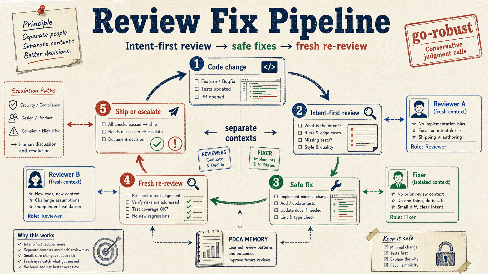

# review-fix-pipeline



> AI agents suffer from the same self-review bias as humans — they unconsciously avoid re-detecting their own mistakes. This pipeline reduces that bias structurally, by separating reviewer and fixer into independent contexts.

Claude Code skills for **intent-first code review** and **automated fix loops** with independent sub-agent contexts.

**Built for Claude Code first, but now bridgeable to Codex/PDCA workflows** when you want review output, fix outcomes, and learned patterns to flow into a shared persistence layer.

**Best for teams using Claude Code** who want review and fix to happen in separate contexts instead of one shared session — while still keeping downstream PDCA/bridge integration explicit and reusable.

## At a glance

- `ifr`: infer intent first, then surface issues within that intent
- `rfl`: apply safe fixes, then re-review with a fresh sub-agent
- `go-robust`: resolve robustness-only judgment calls conservatively without bouncing trivial decisions back to the user
- PDCA bridge helpers: forward markdown / findings / items into a shared review-memory pipeline

## Quick start

```text
/ifr
/rfl
/go-robust
```

PDCA 連携の実運用例は `docs/pdca-bridge-runbook.md` を参照。
fork / clone 後の最短導線は `docs/quickstart-from-fork.md` を参照。
企業向けに eval / ガードレール設計として説明する場合は `docs/eval-guardrail-design-playbook-ja.md` を参照。
クライアント / 面接官向けに工程ごとの説明をする場合は `docs/eval-guardrail-process-explanation-ja.md` を参照。
共通入口として `scripts/pdca_bridge_runner.py` も使える。
※ `bootstrap-pdca-workspace.ps1` は **完全セットアップではなく、環境確認 + env 補助の stub**。

---

## The Problem

When an LLM writes a fix and then reviews it in the same context window, it already "knows" why the code looks the way it does. The reviewer and the fixer share the same blind spots.

The standard approach (write → review → fix in one session) produces the same cognitive shortcuts that make human self-review unreliable.

## The Solution

Separate review and fix into **independent contexts**. Each reviewer is a fresh sub-agent with no knowledge of what changed or why — it can only judge what it sees.

```
                    ┌─────────────────────────────────┐
                    │  Code change (diff or files)    │
                    └────────────────┬────────────────┘
                                     │
                    ┌────────────────▼────────────────┐
                    │  [ifr] Intent-First Review      │  ← Sub-agent A
                    │  Infer intent → find issues     │    (fresh context)
                    └────────────────┬────────────────┘
                                     │
                         ┌───────────▼───────────┐
                         │ ## Auto-fixable       │
                         │ ## Requires confirm.  │
                         └───────────┬───────────┘
                                     │
                    ┌────────────────▼────────────────┐
                    │  Main context applies fixes     │  ← Fixer
                    │  (critical: empirically tested) │    (separate context)
                    └────────────────┬────────────────┘
                                     │
                    ┌────────────────▼────────────────┐
                    │  [rfl] Re-review (new sub-agent)│  ← Sub-agent B
                    │  Modified files only            │    (knows nothing of A)
                    └────────────────┬────────────────┘
                                     │
                         ┌─────────────────────────────────┐
                         │  Still auto_fixable?            │
                         │  Yes → loop (max 5)             │
                         │  No  → /go-robust → commit/push │
                         └─────────────────────────────────┘
```

---

## Skills

### `ifr` — Intent-First Review

Reviews code by **first inferring the author's intent**, then surfacing issues within that intent rather than rejecting it outright.

```
Intent: Minimize latency by caching computed values

## Auto-fixable
### Cache key collision risk
- severity: warning
- auto_fixable: true
- What happens: Two different inputs can produce the same cache key
- Why: str(obj) is not unique for custom objects
- Fix: @ src/cache.py:42 — use hash(frozenset(obj.items())) instead

## Requires confirmation
severity: warning
auto_fixable: false
Issue: Cache is never invalidated
Detail: Stale values accumulate indefinitely; memory grows unbounded over time
Decision point: TTL-based eviction vs explicit invalidation on write?
```

Key behaviors:
- Infers intent before judging — avoids "why didn't you just use X" style feedback
- No finding count limit — every issue is reported
- `auto_fixable: true` = deterministic fix, no design judgment needed
- `requires_confirmation` = design decision required from the author (exception: robustness-only tradeoffs with no behavior change are auto-resolved by the fixer)

### `rfl` — Review-Fix Loop

Orchestrates `ifr` as a sub-agent, applies fixes, then re-reviews with a **new** sub-agent. Repeats until clean or 5 iterations.

Key behaviors:
- **Fresh sub-agent each loop** — no context bleed between reviewer and fixer
- **Empirical verification before applying `critical` fixes** — runs `python -c` or `node -e` to confirm the issue actually exists before touching the code
- **False-positive early exit** — when false positive rate exceeds 50%, the loop terminates rather than continuing to degrade
- **Loop state persisted to JSON** — survives context compaction; resumes from the correct loop number
- **Parallel review modes** — `--d` (Opus + Codex dual review) and `--parallel` (3-model consensus)

### `go-robust` — Requires-Confirmation Processor

Applies five principles to every `requires_confirmation` item from a review and resolves whatever can be decided without further input:

1. Robustness / maintainability / stability first
2. On uncertainty, bias toward the safer assumption
3. No silent problems — anything anomalous must be detectable (exception, log, assertion)
4. Keep the change necessary and sufficient — no gratuitous refactors
5. AI-agent readability / long-term maintainability — a fresh-context agent should be able to navigate the file immediately

Runs automatically after `/ifr` and `/rfl` finish. Items that still require human judgment are surfaced; everything else is committed and pushed.

---

## Enforcement Hooks (optional)

To guarantee `/go-robust` runs before review output is returned to the user, install the two hooks in `hooks/`:

- `enforce-go-robust-submit.py` — UserPromptSubmit. Tracks when `/ifr`, `/rfl`, or `/go-robust` is invoked and records the session state in `~/.claude/state/go-robust-enforce/<session_id>.json`.
- `enforce-go-robust-stop.py` — Stop. When the assistant's last message contains `requires_confirmation` markers (any of: `## 要確認` + severity + `auto_fixable: false`, the `─────` separator, or list-form severity lines like `- [warning] ...` / `1. [critical] ...` produced by `/rfl` aggregation) and `/go-robust` has not yet run for the current review cycle, returns `decision: "block"` with a reason so the runtime forces `/go-robust` to execute.
- `review_outcome_contract.py` — shared review outcome payload builder. Normalizes reviewer aliases, item fields, repo-relative paths, and can forward the payload to `claude-review-pdca`'s producer. Use `--forward-to-pdca` for sibling-repo auto-discovery, or override with `--producer-path`, `--pdca-root`, `PDCA_PRODUCER_PATH`, or `CLAUDE_REVIEW_PDCA_ROOT`.
- `review_output_bridge.py` — bridge from existing `/ifr` `/rfl` markdown output to the shared outcome contract. Prefers embedded machine-readable blocks when present, but can fall back to parsing the current legacy markdown sections (`## 自動修正可`, `## 要確認`) and optionally forward the resulting payload to PDCA.
- `review_feedback_bridge.py` — bridge from existing `review-feedback.py record --findings '[...]'` JSON to the shared outcome contract / PDCA producer. Best fit for `/rfl` completion because it reuses the already-structured findings list without reparsing markdown.

Escape hatches (for the rare case you explicitly want to skip):

- `--no-go-robust` flag on the review command (one-shot bypass for the current cycle)
- `/skip-go-robust-once` command issued after the review output (one-shot bypass for the next response)

Safety caps: `stop_hook_active` short-circuits; after `MAX_ENFORCE = 2` automatic blocks in the same cycle the hook keeps blocking with an explicit recovery message (it does **not** silently pass — use the escape hatches above to proceed); `bypass_once` is consumed after a single use.

---

## Setup

> **Prerequisite:** The setup commands and `rfl` shell examples require **Git Bash** (Windows) or a POSIX shell (macOS/Linux). PowerShell is not supported.

> **Note (for this repo's maintainers):** The skill files in `skills/` are exposed at `~/.claude/skills/<name>` via Windows junctions (`mklink /J`) so the cloned repo is the single source of truth; editing the repo immediately reflects into the loaded skill. The `cp`-based setup below is for external users installing the skills into their own Claude Code environment.

```bash
git clone https://github.com/Tenormusica2024/review-fix-pipeline
cd review-fix-pipeline

# Intent-First Review (/ifr)
mkdir -p ~/.claude/skills/ifr
cp skills/ifr/SKILL.md ~/.claude/skills/ifr/SKILL.md

# Review-Fix Loop (/rfl)
mkdir -p ~/.claude/skills/rfl
cp skills/rfl/SKILL.md ~/.claude/skills/rfl/SKILL.md

# Requires-Confirmation Processor (/go-robust)
mkdir -p ~/.claude/skills/go-robust
cp skills/go-robust/SKILL.md ~/.claude/skills/go-robust/SKILL.md

# Scripts (required for all modes)
mkdir -p ~/.claude/scripts
cp scripts/merge_parallel_reviews.py ~/.claude/scripts/merge_parallel_reviews.py
cp scripts/review-feedback.py ~/.claude/scripts/review-feedback.py

# Enforcement hooks (optional — see "Enforcement Hooks" section above)
mkdir -p ~/.claude/hooks
cp hooks/enforce-go-robust-submit.py ~/.claude/hooks/enforce-go-robust-submit.py
cp hooks/enforce-go-robust-stop.py ~/.claude/hooks/enforce-go-robust-stop.py
```

After copying the hook scripts, register them in `~/.claude/settings.json` under `hooks.UserPromptSubmit` and `hooks.Stop` so Claude Code invokes them. See the Claude Code hooks documentation for the exact schema.

Usage in Claude Code:

```
/ifr                 # review + auto-fix current changes (intent-first)
/ifr --d             # dual review: Opus 4.6 + Codex gpt-5.4
/ifr --c             # dual Codex review: 2 instances with split angles (quality vs security)
/ifr --parallel      # 3-model consensus: Opus + Codex + GLM (requires ZAI_AUTH_TOKEN)
/rfl                 # review-fix loop (up to 5 iterations)
/rfl --d             # dual review mode per loop
/rfl --c             # dual Codex review mode per loop
/rfl --parallel      # 3-model consensus per loop
/go-robust           # process accumulated requires_confirmation items using the 5 principles
```

---

## Design Decisions

**Why empirical verification for `critical` findings?**

Loop 3+ shows elevated false positive rates. Applying an incorrect `critical` fix breaks working code and creates new bugs for the next loop to catch — compounding errors rather than eliminating them. Verifying the claimed behavior with a minimal reproduction before applying prevents this failure mode.

**Why persist loop state to JSON?**

LLM context windows compact. Without state persistence, a loop interrupted mid-run loses its position and either restarts from loop 1 (wasting compute) or fails to resume entirely. The state file stores loop number, target files, and `session_tmpdir` path so any session can pick up exactly where the previous one left off.

**Why track false positive counts per loop?**

A rising false positive rate is the signal that the model has run out of real issues and is pattern-matching on noise. Treating that signal as a termination condition — rather than continuing until all 5 loops are exhausted — produces cleaner results and avoids introducing regressions from spurious fixes.

---

## Requirements

- [Claude Code](https://claude.ai/code)
- Python 3.10+
- Codex CLI (optional, required for `--d`, `--c`, and `--parallel` modes): `npm install -g @openai/codex`
- `ZAI_AUTH_TOKEN` env var (optional, required for GLM in `--parallel` mode)

## License

MIT
